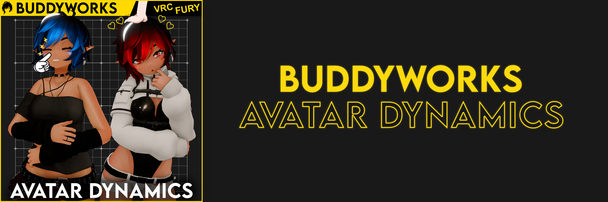

import { Aside } from '@astrojs/starlight/components';

  

*Free and simple avatar dynamics!*

#### Welcome to the Avatar Dynamics Docs
Avatar Dynamics is a simple system that gets you headpat and noseboop interaction quickly.

The following pages will tell you some things about the system.

#### Downloads
<a href="https://buddyworks.gumroad.com/"><b>Gumroad</b></a>  
<a href="https://repo.buddyworks.wtf/"><b>VPM</b></a>  
\
<Aside>The documentation will refer to Avatar Dynamics as **AD**, please keep that in mind.</Aside>