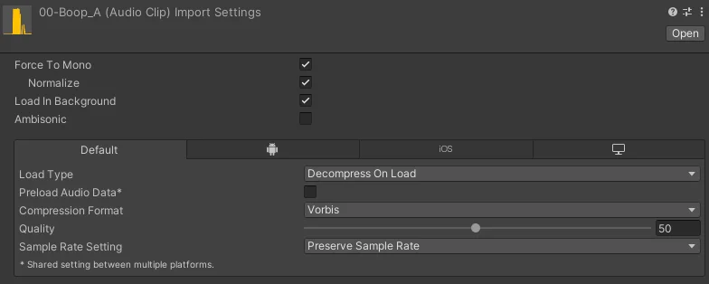

import { Aside } from '@astrojs/starlight/components';

:::note
The Modding documentation assumes existing Unity knowledge and how to work with VRCFury Prefabs to locate data like the FX Controller.
:::

### Notes and Caveats
Since AD is distributed as a Package, you will need to reapply your modifications after every update. 
Using the .unitypackage version is more recommended for more permanent setups, this will make updating the asset more difficult though   

Do not store custom data inside the AD Folder, since the data gets replaced after every update or reinstallation of the AD Package. **Store any custom data in /Assets/.**  

### Adding new Sounds
The noseboop feature comes with an easy to edit layer to increase the number of unique noseboop sounds you can have.  
We currently don't know how far you can push this, but at least 200 sounds are possible.

#### Prepare the Audio Files
Make sure your sounds all use these import settings:
  
This gives you a good compatibility and space efficient import.  

#### Add your Sounds to the Audio Component
Open the *BUDDYWORKS Avatar Dynamics - FX* controller through the prefab or directly and take a look at the layer *BUDDYWORKS Avatar Dynamics/Sound Effects*, there you will find two states: **Boop Audio** and **Randomize**.

Click on **Boop Audio**, you will notice your inspector changing.  
Inside the *VRC Animator Play Audio* component, you can add more audio clips inside the "Clips" field. (You might need to expand it.)  

Once that is done, you need to click on **Randomize** and increase the "Max Value" to the amount of clips used.  
Note that "0" is the first clip.

You're done!