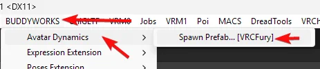

import { Aside } from '@astrojs/starlight/components';

### Setup

Setup is easy, just add the prefab to your avatar and you are ready to go!

  

### Some items are greyed out!
AD performs checks to ensure that the necessary component is present in your project.  
If an option is greyed out, you are missing the dependency needed for that option in your project.  

### Checks  
VRCFury = Is package `com.vrcfury.vrcfury` present?  