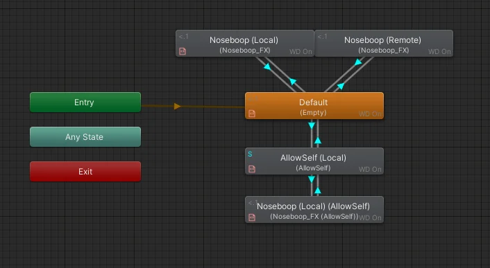
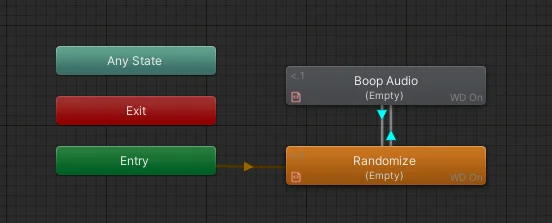

import { Aside } from '@astrojs/starlight/components';

### FX Controller
#### Effect Layers
  
The controller makes heavy use of isLocal assumptions and will work different based on who is running it.  

**User (you):** Process contact-checks, run the animation for yourself and also set the parameter *AD/Noseboop* or *AD/Headpat* to true for a brief time.  

**Remote (others):** Listen for parameter *AD/Noseboop* or *AD/Headpat* to change, and run when that is true.

Remote does not perform contact checks, which makes it more reliable.

#### Sound Layer
  
Will run whenever parameter *AD/Noseboop* is true, play a sound and shuffle *AD/Random* once done playing.  
This is processed separately to ensure that you and remote players hear the same sound every time.

### Parameters

##### Main Parameters [synced or unsynced]
- **AD/Noseboop [Bool]:** Whenever the nose is booped. SFX listens to this value.
- **AD/Headpat [Bool]:** Whenever the head is pat. 
- **AD/Random [Int]:** Used to select the audio clip for noseboops.

##### Support Parameters [always unsynced]
- **AD/Safety/Noseboop [Bool]:** Determines whenever Nosebooping should work or not.
- **AD/Safety/Headpat [Bool]:** Determines whenever Headpats should work or not.
- **AD/Safety/AllowSelf [Bool]:** Controls whenever you can interact with yourself. 
