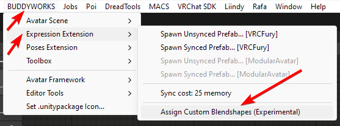
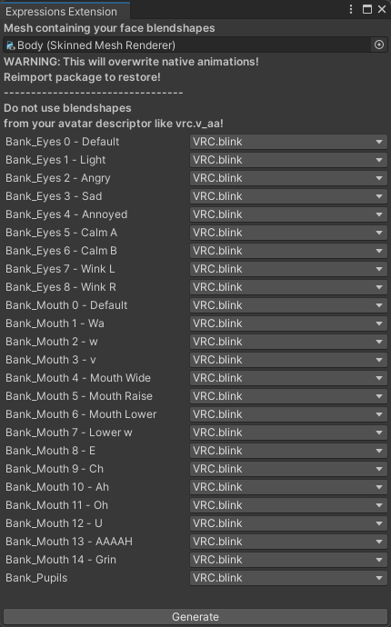

import { Aside } from '@astrojs/starlight/components';

### Assign custom blendshapes

A script is provided that lets you add rudamentary support for non-standard avatars.

  
  

The editor window will grab all current expression clips and offer you to reassign those to your avatars blendshapes. This is very simple, and will likely not give you optimal results.  

Make sure that all entries are assigned, and no blendshapes are used that are also used in the Avatar Descriptor.  
If a blendshape from the Avatar Descriptor, like those starting with **"vrc."**, is used, you will break viseme (lipsync) support.

If you are lacking a specific blendshape, you can just reuse a different one in the same slot.

Your blendshape selection doesn't need to match the label of the Bank, you can use any blendshapes you want.  
Make sure that you dont put mouth blendshapes to the Bank_Eyes slots and vice versa.

Bank_Pupil is for the pupil size slider. If you don't have a blendshape for that, use anything remotely similiar. If you end up using Blink or Wink here, make sure to not use the one in the Avatar Descriptor blink if used, else you break native blinking.

<Aside>This feature is forever-experimental, no support is provided when using it. Reimport Expressions Extension to restore the original MMD setup!</Aside>