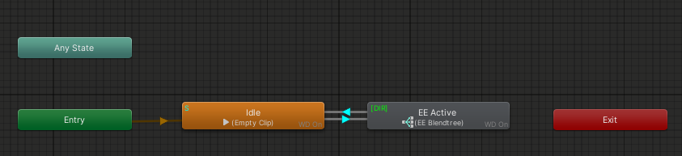
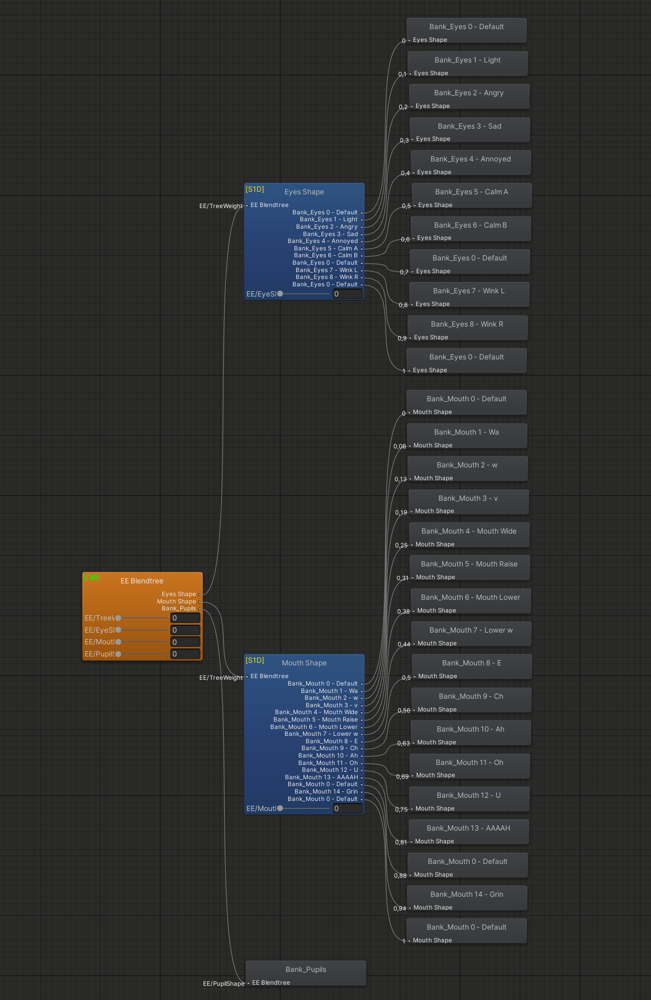
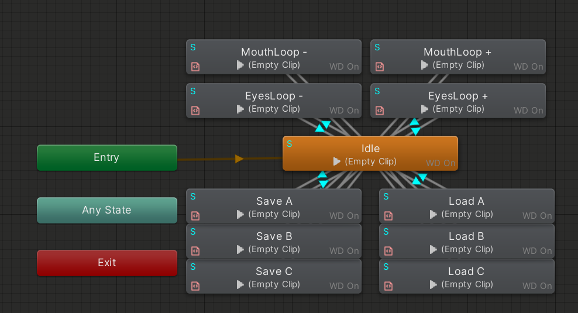

import { Aside } from '@astrojs/starlight/components';

### Main Logic
  
  

By default, EE will be inactive and wait for EE/Active to be true.  
Once that is the case, EE will be engaged and is controlled using the floats.

### Support Logic
  
This layer is used for any additional functions.

Currently, it is responsible for making the infinite circle loop work for Mouth and Eye selection.
Additionally, the save and load logic is handled here using parameter drivers.
Triggers are used to make those immediate and self-resetting.

<Aside>Please be aware that Expressions Extension is under constant development, and information in the docs might get outdated.</Aside>