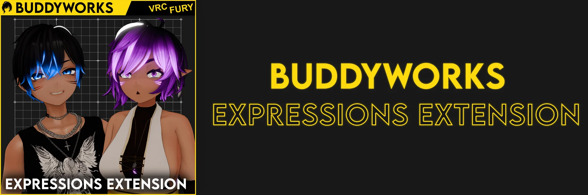

import { Aside } from '@astrojs/starlight/components';

  

*Gimmick for face expression mixing, useful for photography.*

#### Welcome to the Expressions Extension Docs
Expressions Extension is an easy-to-use system to adjust your avatars facial expression for photography.

The following pages will tell you some things about the system.

#### Downloads
<a href="https://buddyworks.gumroad.com/"><b>Gumroad</b></a>  
<a href="https://repo.buddyworks.wtf/"><b>VPM</b></a>  
\
<Aside>The documentation will refer to Expressions Extension as **EE**, please keep that in mind.</Aside>