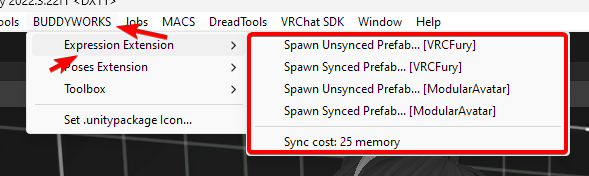

import { Aside } from '@astrojs/starlight/components';

### Setup

Setup is easy, just add the prefab to your avatar and you are ready to go!

  

### Which version to pick?
As you might have seen, there are a couple options to choose from:
- **Spawn Unsynced Prefab...:** Your face expression won't sync to other players.
- **Spawn Synced Prefab...:** Your face expression will sync.

What version you pick depends on what you will use EE for.  
In most cases, going for the Unsynced version for photos should be sufficient.  

<Aside>EE costs 25 memory in your parameters synced, using the unsynced version costs 0.</Aside>

### Some items are greyed out!
EE performs checks to ensure that the necessary component is present in your project.  
If an option is greyed out, you are missing the dependency needed for that option in your project.  
You don't need to import all dependencies to use EE, either VRCFury or ModularAvatar is sufficient.

### Checks  
VRCFury = Is package `com.vrcfury.vrcfury` present?  
ModularAvatar = Is package `nadena.dev.modular-avatar` present?  