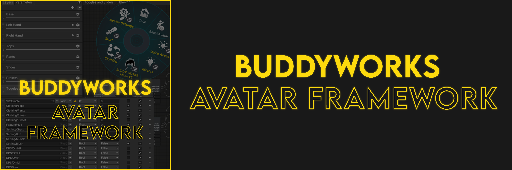

import { Aside } from '@astrojs/starlight/components';

  

*Quick-start your creation process, every time!*

#### Welcome to the Avatar Framework docs.  
This page will explain various aspects of the framework, from its usage to more advanced applications.  

<Aside> We generally assume Framework v2, but this should mostly apply to v1 as well.</Aside>

