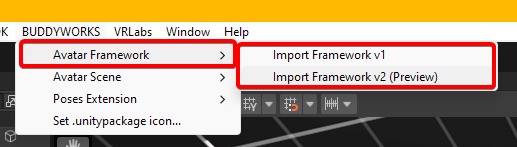

## Installation Instructions
Getting started is simple, just grab the package from our <a href="https://repo.buddyworks.wtf">VCC Repository</a> and import it into your project.  

After import, you can add the resource data into your /Assets/ folder using the new Toolbar Menu:  

  

Clicking those will open a prompt which asks you to choose a directory to add the files to.  

By default, this can be the root directory. Note that if there is already a Directory called "BUDDYWORKS" at your target, the new folder will be called "BUDDYWORKS 1" to avoid overwriting data by accident.

After that is done, you are good to go. Proceed to use the new template files for your new project.

**Important Files**
- **\_BW_FX:** The FX Animator used for the avatars logic.
- **\_BW_Main Menu:** The root menu file.
- **\_BW_Parameters:** A list of parameters used inside the FX.

You will learn about the structure of the menu and FX on the following pages.