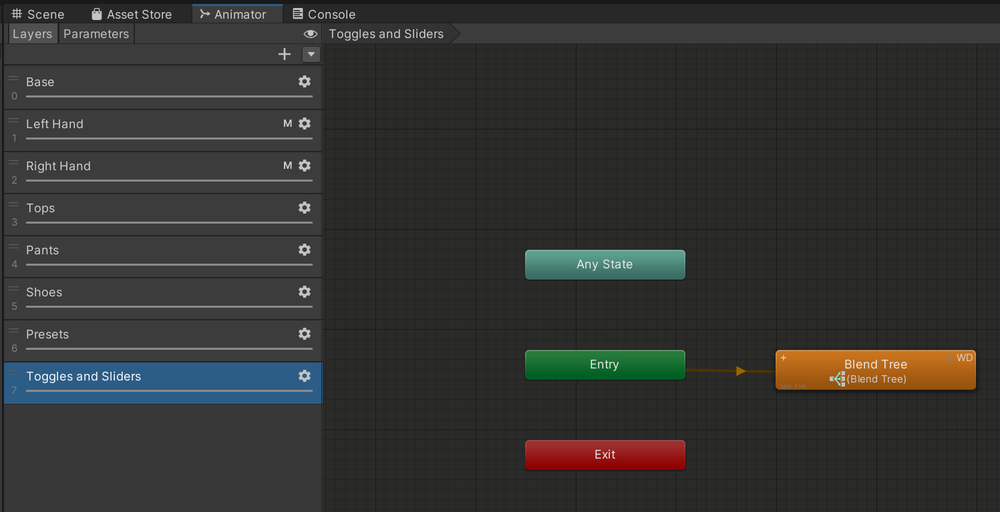

import { Aside } from '@astrojs/starlight/components';

**The FX-Template**

The FX template is named "\_BW_FX".  
It contains the essential layers commonly used by avatars, you can duplicate and expand as you see fit.  

<Aside> v1 and v2 have almost the same FX Controller, the only difference is a slightly different approach with the Presets Layer. </Aside>

### FX Animator

  

<Aside type="caution"> The animator is written in full WriteDefaults ON workflow, please keep that in mind.</Aside>

- **Base:** Obligatory, make sure it is empty at all times.
- **Left/Right Hand**: Layers for face expressions made with your hands.
- **Tops/Pants/Shoes:** INT switches that allow you to write exclusive toggles.
- **Presets:** You can use the Presets layer to drive multiple parameter drivers at once, allowing for preset sets of your toggles.
- **Toggles and Sliders:** The heart of operation, this is a premade DirectBlendTree ready to use.

To learn more about DirectBlendTrees, we can recommend this writeup: <a href="https://notes.sleightly.dev/dbt-combining/">Combining Layers Using Direct Blend Trees</a>

This is the gist, you will find more fine-grained detail in the text document provided inside the Avatar Framework folder or <a href="../doc2">here</a>.