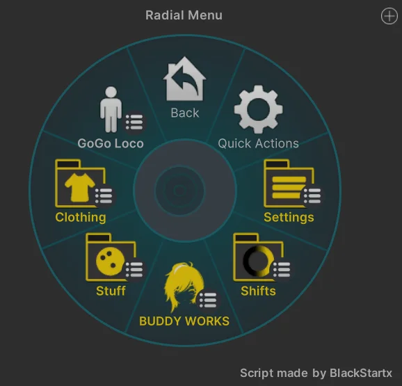

import { Aside } from '@astrojs/starlight/components';

## Overall Menu Layout

BUDDYWORKS Menus are prefixed with "\_BW".  
The menu comes with my lovely programmer-art as substitute icons, you probably want to replace those for your own icons.

<Aside>The structure for v2 is heavily slimmed down compared to v1, which used to be a bit convoluted.  
v2 prefers speedy use, while v1 prefers a fully fledged folder structure.   
**Both are fine when used correctly.**</Aside>

### Main Menu

  

- **Settings:** Any kind of general settings, like contact toggles or other low-frequency options.
- **Shifts:** All your shifts, be it hue shifts or other sliders, go here.
- **Logo Menu:** Used as a quick menu for features you expect people to use often.
- **Stuff:** Props, funky features, any kind of toggles that don't belong elsewhere.
- **Clothing:** Contains all clothing options of the avatar.
- **GoGo Loco:** A placeholder for GoGO Locomotion. When using the VRCFury Prefab for GGL, this menu gets overwritten.

All these menus contain sub menu which should be self explainatory.