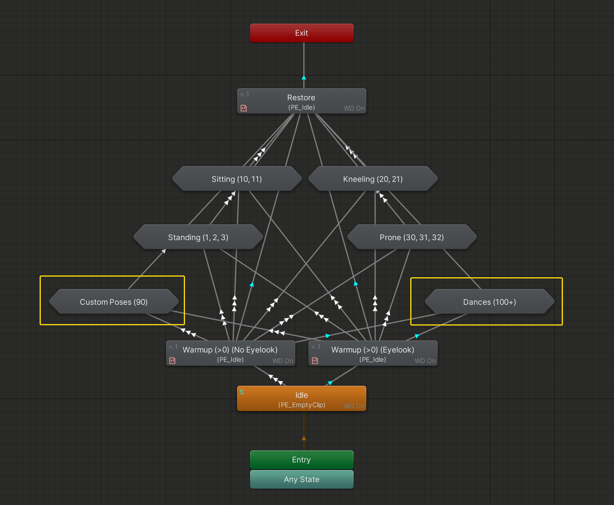
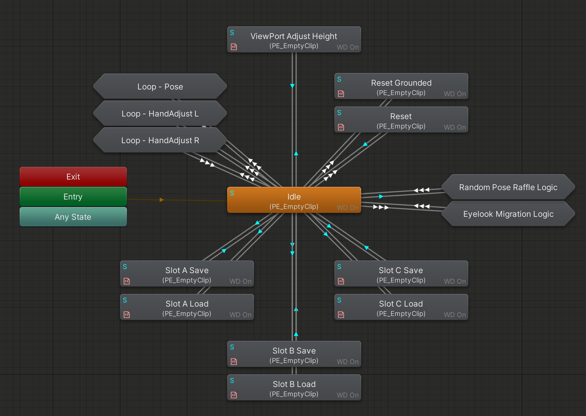

import { Aside } from '@astrojs/starlight/components';

### Poses&Dances
  

By default, PE will be inactive and wait for any kind of input.  
Whenever PE/Set is greater than 0, the layer will advance to *Warmup*, which is responsible to put the avatar in a posable state.  

Once that is done, we move on to the state selected with PE/Set. Dances and Poses are treated the same here, only difference being how they use the PE/Float value.
- **Poses:** Motion Time
- **Dances:** Speed

A direct transition from Warmup to Restore should ensure that the logic works and syncs reliably in case of fast or invalid inputs.

For visual differentiation, we just split Poses and Dances with the middle line, poses being on the top half and dances on the bottom half. This might get packed into statemaschines in the future if needed. 

If PE/Set changes away from the current active set, the layer will advance to *Restore* and loop back.  
**Restore** re-engages tracking, essentially reversing changes done in **Warmup**

### Support Logic
  
This layer is used for any additional functions.

Currently, it is responsible for making the infinite circle loop work whenever the value of PE/Float hits 0 or 100.  
For the GGL Variant, an additional local check is done to make sure this function only runs when the user interacts with PE, but not with GGL.

<Aside>Please be aware that Poses Extension is under constant development, and information in the docs might get outdated.</Aside>