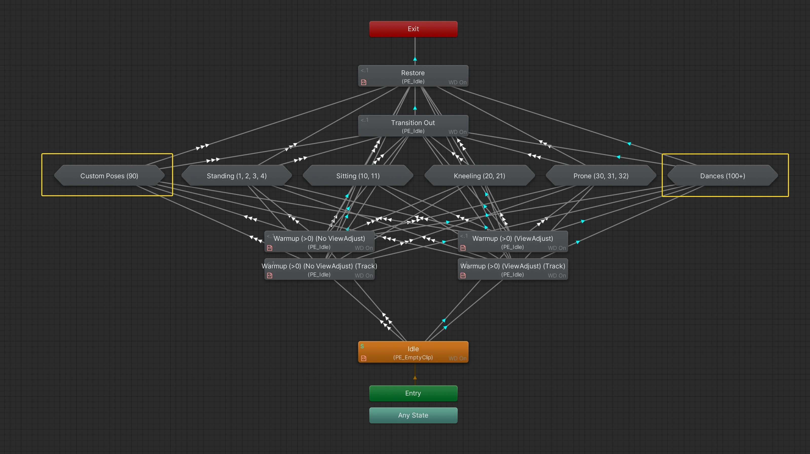
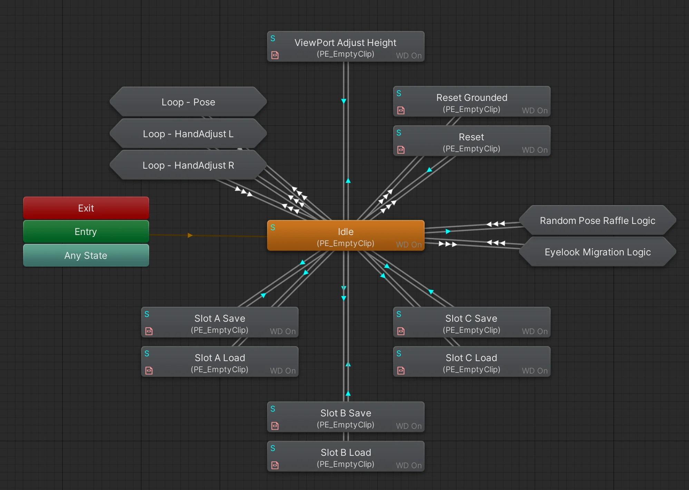
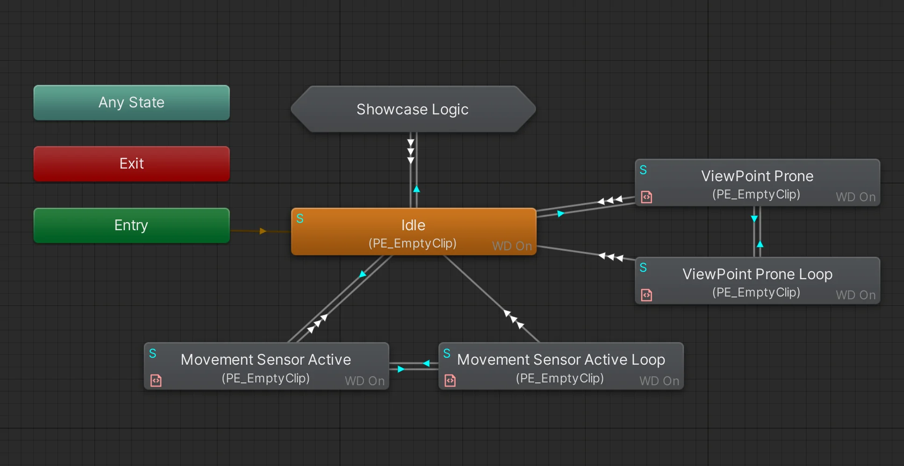

import { Aside } from '@astrojs/starlight/components';

<Aside>The action controller for the **GGL-Variant** is a simpler version of this, the idea is the same.</Aside>

### Action Layers

- **BUDDYWORKS Poses Extension - Poses&Dances:** Main layer for pose and emote logic.
- **BUDDYWORKS Poses Extension - Support Logic A:** Controls slider loops, reset handling, viewport and save/load.
- **BUDDYWORKS Poses Extension - Support Logic B:** Orchestrates showcase system and helper functions.

#### Poses&Dances
  

By default, PE will be inactive and wait for any kind of input.  
Whenever PE/Set is greater than 0, the layer will advance to *Warmup*, which is responsible to put the avatar in a posable state. The warmup transition is forked, depending on whenever Eyelook is engaged or not. The difference is whenever eyes should be included in pose space or not.  
The track fork allows experimental partial tracking while posing.

Once that is done, we move on to the state selected with PE/Set. Dances and Poses are treated the same here, only difference being how they use the PE/Float value.
- **Poses:** Motion Time
- **Dances:** Speed

A direct transition from Warmup to Restore should ensure that the logic works and syncs reliably in case of fast or invalid inputs.

If PE/Set changes away from the current category, the layer will advance to *Restore* and loop back.  
Changes between banks of the same category will be direct, without going to *Restore* first.  

Each state machine contains a normal and a mirrored pose of each category's banks, PE/Mirror controls which one is selected.

**Restore** re-engages tracking, essentially reversing changes done in **Warmup**

You can make use of the state maschines highlighted in the image "Custom Poses (90)" and "Dances (100+)" to include your own data in PE, more on that in the [Modding Section](/posesextension/modding).

#### Support Logic A
  
This layer is used for the majority of logic functions.

**Reset / Reset Grounded**  
Reset is called throughout the logic to reset Poses Extension to its original settings and will also disengage it.  
Reset Grounded engages whenever you get airborne. This circumvents a visual glitch. Will not reset any settings, just disengages Poses Extension. An exception to this is whenever GoGo Loco is installed, which is automatically detected. The detection can be overridden in the settings menu in-game.

**Loops**  
Loops specific radial menus around, making rotation seamless.  
This currently affects the pose radial and each hand for HandAdjust.

**Save / Load**  
Logic to save and store to the provided save slots.
Triggers are used to make those quick and self-resetting.

**ViewPort Adjust**  
Engaged when the HeightSlider is in use, forces your ViewPort to align with the current Pose, including height.

**Random Pose Raffle Logic**  
Helper logic which randomly selects a pose with a simple randomness system.  
It will only select the native pose banks.

**Eyelook Migration Logic**  
Helper logic to migrate your current pose between enabled and disabled eyelook.  
As PE works in two different pose spaces depending on whenever Eyelook is active or not, PE needs to be reengaged to go through the correct branch. This would reset your current selected pose bank, which this writes back to make the migration more seamless.

#### Support Logic B
 

**Showcase Logic**  
Runs the showcase feature. It does so by using Parameter drivers to run the Load-triggers.  
That way, the entire showcase system works without needing any additional synced parameters.  
PE/Favorite/ShowcaseSpeed influences the time it takes to transition from one slot to the next.

**Movement Sensor**  
Support logic that will reset your current viewpoint when moving, since locomotions overwrite that at every opportunity.

**ViewPoint Prone**  
If *PE/Settings/ViewPointProne* is active, this will allow the viewpoint to change for the prone pose bank, which is normally disabled.
