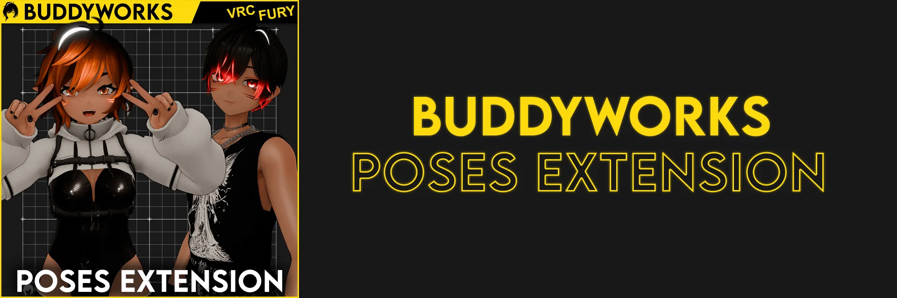

import { Aside } from '@astrojs/starlight/components';

  

*Locomotion-agnostic pose framework.*

#### Welcome to the Poses Extension Docs
Locomotion-agnostic pose system for VRChat Avatars, meant to be used for photography.  
Make beautiful photos of your avatar, even in Desktop mode!

The following pages will tell you some things about the system.

#### Downloads
<a href="https://buddyworks.gumroad.com/"><b>Gumroad</b></a>  
<a href="https://repo.buddyworks.wtf/"><b>VPM</b></a>  
\
<Aside> All documents are made for BUDDYWORKS Poses Extension 5.2.1 or newer.</Aside>