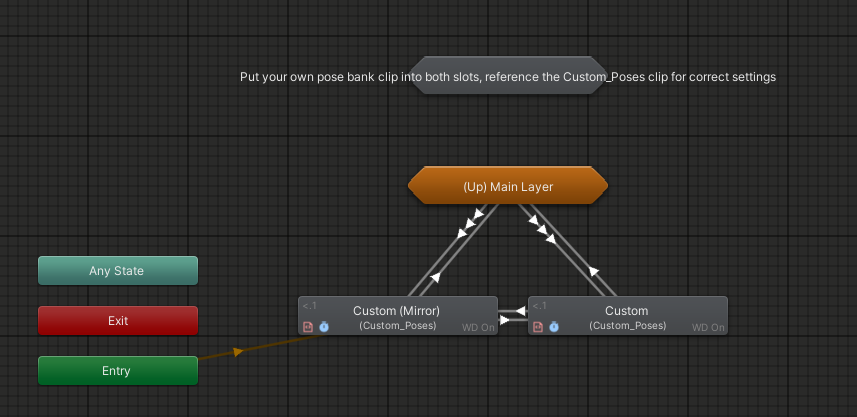
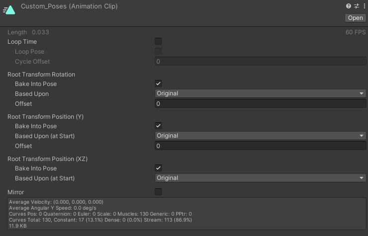
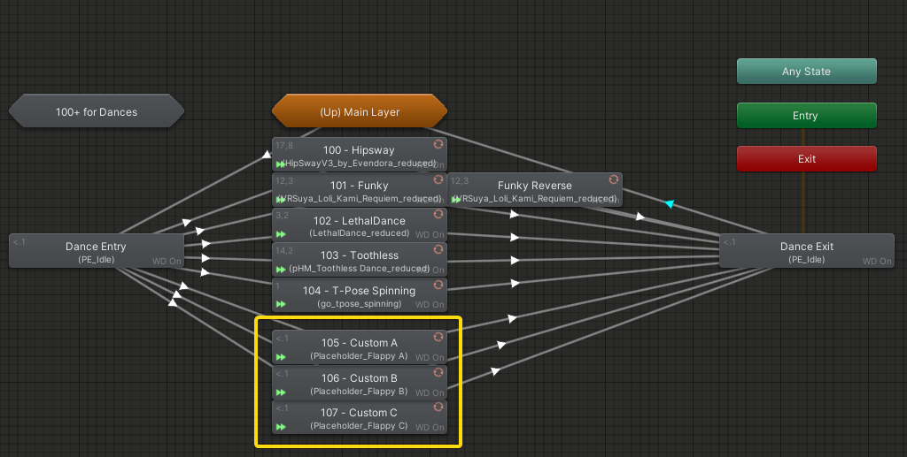

import { Aside } from '@astrojs/starlight/components';

:::note
The Modding documentation assumes existing Unity knowledge and how to work with VRCFury Prefabs to locate data like the Action Controller.
:::

## Modding Poses Extension
Poses Extension provides you with ways to include custom data into the system. 

Officially supported modding revolves around:
- Populating the *Custom Poses* bank 90.
- Adding additional dances.

### Notes and Caveats
Since PE is distributed as a Package, you will need to reapply your modifications after every update.  

Also, do not store custom data inside the PE Folder, since the data gets replaced after every update or reinstallation of the PE Package. **Store any custom data in /Assets/.**  

:::danger[Caution]
Do not modify the native PE Pose banks!  
The setup of those is more complicated, you will break stuff.
:::

### Custom Poses
PE allows you to import your own pose bank into *PE/Set 90*, a reserved slot with a provided menu for your custom poses.  
You can find that menu ingame inside the **More...** menu.
:::note
Custom poses do not support Eyelook or Height adjust, as the setup for those is rather delicate.
:::
To add custom poses, access PE's Action Controller. You should see the main [PE logic-tree](/posesextension/action).   

Double click **Custom Poses (90)** to enter that state maschine.
  

The relevant parts of this are **Custom** and **Custom (Mirror)**. Slot your own Pose Bank in both slots.  
If you want two pose banks and don't need the Mirror functionality, you can slot a different pose bank in **Custom (Mirror)** and disable the "Mirror" checkbox in its inspector. You can switch between those using the Mirror toggle.

#### Pose Clip Setup
Add all your poses after each other into a single animation clip, use the preview window to check if the poses look correct.  
If you want a smooth loop like the built-in poses, make sure your last pose is equal to your first pose.
Your pose bank animation clip should be set up like this for best results:
  

### Custom Dances
PE allows you to add your own dances, and provides menus for that. We provide you with three slots you can directly populate with your own dance animations. While you can expand this by following the provided logic yourself, **we discourage adding too much, as dances inflate uncompressed avatar size drastically!**  

To add custom dances, access PE's Action Controller. You should see the main [PE logic-tree](/posesextension/action).  
In there, double click **Dances (100+)** to access the Dance State Maschine.

Slot in your own dances in the highlighted slots, and that should be it! Just make sure your dance animation clips are set to loop.  
You can access those three custom dances in the **Dances** menu. If you add more than those, you need to modify the menus.  
Dances have a reserved *PE/Set* range of 100 or higher, so start dances beyond the 3 provided slots at *PE/Set* 108.
  

:::note
Adding more dances past the 3 provided slots, while not difficult, is not officially supported.  
You are free to replace the built-in dances with your own if you want, 101 has special logic to play the dance backwards once it's done playing forwards.
:::