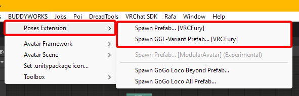
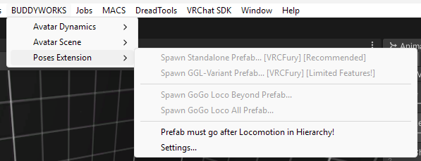

import { Aside } from '@astrojs/starlight/components';

### Setup

Setup is easy, just add the prefab to your avatar and you are ready to go!

  

### Which version to pick?
As you might have seen, there are two variants to pick:
- **Spawn Prefab... =** The default version of Poses Extension
- **Spawn Prefab... (GGL Experimental) =** A variant of Poses Extension for GoGo Loco

To save parameter space in GoGo Loco setups, the GGL Experimental variant will make use of existing GGL parameters, specifically Go/Float and Go/VRCEmote. This makes Poses Extension free to use, but adds a breaking point whenever GoGo Loco does any major changes.  

Please assume that Poses Extension will only work with the latest version of GoGo Loco. Any other release MIGHT work, but is not supported.

<Aside>The regular version will work in any case, even in a setup with GoGo Loco.</Aside>

### And the other options?
You will see two additional options in the toolbar menu, these are just for convenience and allow you to spawn in the regular GoGo Loco prefabs. If GoGo Loco is not imported, these options will be greyed out.

  