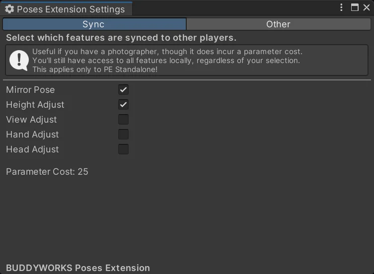

import { Aside } from '@astrojs/starlight/components';

### Setup

Setup is easy, just add the prefab to your avatar and you are ready to go!

  

### Which version to pick?
As you might have seen, there are a couple options to choose from:
- **Spawn Standalone Prefab... [VRCFury]:** The full version of Poses Extension.
- **Spawn GGL-Variant Prefab... [VRCFury]:** A variant of Poses Extension for GoGo Loco

To save parameter space in GoGo Loco setups, the GGL-Variant will make use of existing GGL parameters, specifically Go/Float and Go/VRCEmote. This makes Poses Extension free to use, but adds a breaking point whenever GoGo Loco does any major changes.  
Also, the GGL-Variant does not include all features Standalone does, please keep that in mind.

Please assume that Poses Extension GGL-Variant will only work with the latest version of GoGo Loco. Any other release MIGHT work, but is not supported.

<Aside>The regular version will work in any case, even in a setup with GoGo Loco.</Aside>

### And the other options?

#### Spawn GoGo Loco...
These two options allow you to spawn in the regular GoGo Loco VRCFury prefabs.  
These options exist for convenience.

If you want to be able to fly with GoGo Loco, you pick the "Beyond" version, else use the "All" one.

#### Settings
  
The settings window that can be opened in the menu toolbar allow you to change whenever a feature is synced or not. Syncing costs parameters, so adjust to your needs.  
Regardless of your choice, all features will always be present locally.

### Some items are greyed out!
PE performs checks to ensure that the necessary component is present in your project.  
If an option is greyed out, you are missing the dependency needed for that option in your project.  

  

### Checks  
VRCFury = Is package `com.vrcfury.vrcfury` present?  
GoGo Loco = Do the GoGo Loco VRCFury prefabs exist in your project? Checks by GUID. Dynamically adjusts based on your GoGo Loco version since GoGo Loco 1.8.5.  