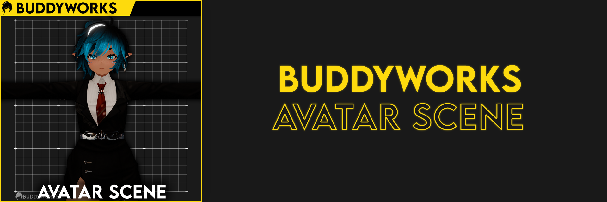
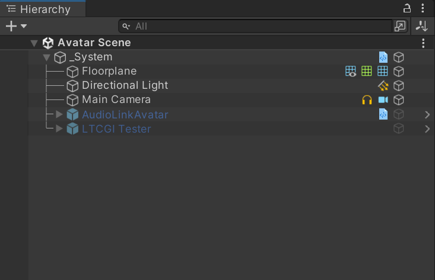
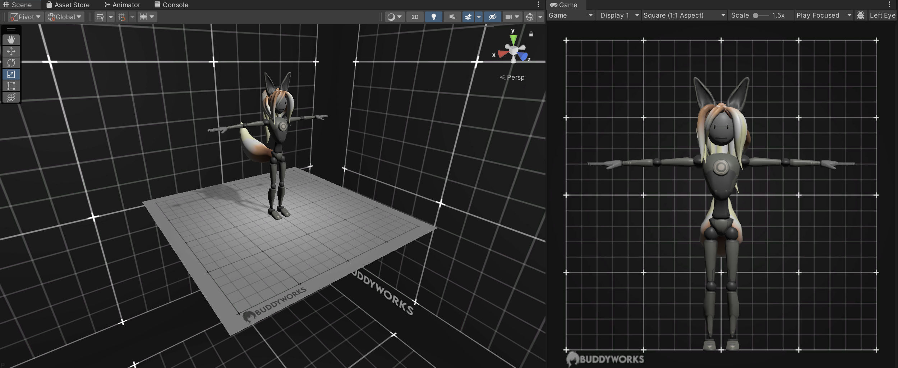

import { Aside } from '@astrojs/starlight/components';

  

#### About the Scene

  

The scene structure is rather simple. The object "\_System" contains all scene elements and assets.  
<Aside>When installing the VCC version, the AudioLinkAvatar and LTCGI Tester prefabs might not appear if you didn't import the packages beforehand.</Aside>

- **Floorplane:** A simple plane your work stands on, looks like a 3D Print plate.
- **Directional Light:** A neutral light suitable for good color reproduction in ideal conditions.
- **Main Camera:** A orthographic camera, as seen as in the game view. Used to check symetry.
- **AudioLinkAvatar:** When enabled, will start a YouTube Video as audio. If your materials use AudioLink, they will react to that.
- **LTCGI Tester:** A tester for LTCGI effects. Note that this only works for materials that support it.

  