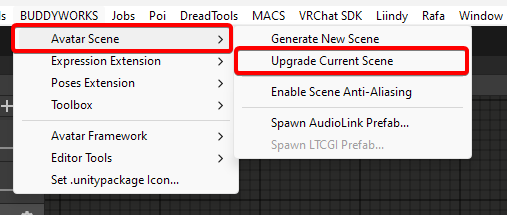

import { Aside } from '@astrojs/starlight/components';
import { Tabs, TabItem } from '@astrojs/starlight/components';
import { Steps } from '@astrojs/starlight/components';

### Installing the Template
The installation process depends on which distribution you use.  
You need to import AudioLink and LTCGI beforehand if you plan to use them.  

## Installation
<Tabs>  
  <TabItem label="VCC - New Scene">
  	<Steps>
			1. Getting started is simple, just grab the package from our <a href="https://repo.buddyworks.wtf">VCC Repository</a> and import it into your project.  
			2. After that, you can copy the data into your */Assets/* directory by using the toolbar menu:  
			  
			3. Once done, you will find the data in */Assets/BUDDYWORKS/Avatar Scene*  
			The script will open the scene for you.
			<Aside> If there was an error or the data is already imported, the import will abort and you will get a corresponding message printed into your console.</Aside>
		</Steps>
 	</TabItem>
 	<TabItem label="VCC - Upgrade existing Scene">
 		<Steps>
 			0. **Backup your existing scene!**
 			1. Getting started is simple, just grab the package from our <a href="https://repo.buddyworks.wtf">VCC Repository</a> and import it into your project.  
 			2. After that, use the toolbar menu to start the upgrade process:
 			
 			3. Once complete, the script will display a message saying so. You are done!
 			<Aside> The light and camera of Avatar Scene are disabled by default, since your existing objects still exist. You can disable your old lights and cameras and activate the new ones inside _System</Aside>
 		</Steps>
 	</TabItem>
 	<TabItem label=".unitypackage">
	>	Importing the Unitypackage will directly give you all data inside `/Assets/BUDDYWORKS/Avatar Scene`, you will need to open the scene yourself.   
  That is basically it.
	</TabItem>
</Tabs>