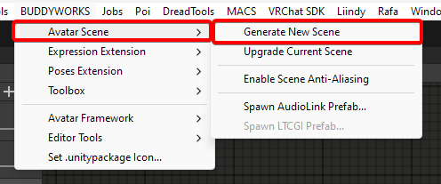

import { Aside } from '@astrojs/starlight/components';

#### Installing the Template

The installation process depends on which distribution you use.  
You need to import AudioLink and LTCGI beforehand if you plan to use them.

##### VCC Package
Getting started is simple, just grab the package from our <a href="https://repo.buddyworks.wtf">VCC Repository</a> and import it into your project.  

After that, you can copy the data into your */Assets/* directory by using the toolbar menu:  
  

This might open a save dialogue, this is for your current scene if you have an unsaved scene open.
If the scene in question is the default scene, just close the save dialogue.

Once done, you will find the data in */Assets/BUDDYWORKS/Avatar Scene*  
The script will open the scene for you.

<Aside> If there was an error or the data is already imported, the import will abort and you will get a corresponding message printed into your console.</Aside>

##### .unitypackage
Installing the Unitypackage will directly give you all data inside */Assets/BUDDYWORKS/Avatar Scene*, you will need to open the scene yourself. That is basically it.