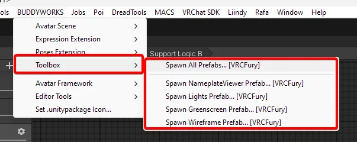
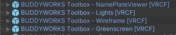

import { Aside } from '@astrojs/starlight/components';
import { Tabs, TabItem } from '@astrojs/starlight/components';
import { Steps } from '@astrojs/starlight/components';

### Setup

Setup is easy, select your avatar in the hierarchy and add the prefab(s) to your avatar using the toolbar menu.

  

You can choose which [components](/toolbox/overview/) you want, or all of them at once.

Upload and enjoy~
